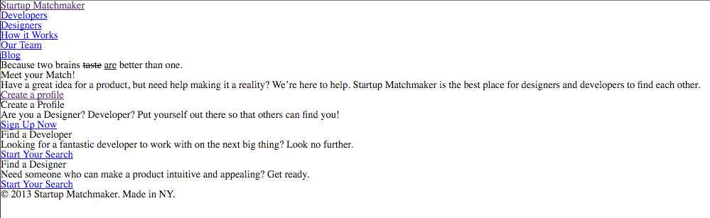

### **<u>Startup Matchmaker Lab</u>**

#### **Suggested steps to follow**

The goal for this project/lab is to:

- accurately represent the design file using HTML/CSS
- track your progress via your a commit history
- research new tags lik `<del>` and `<ins>`

**<u>Step 1</u>**


**Setup files/folders** 

>
>*est. time to complete - ~10 - 15 mins*

1. Create a new repo on GitHub called `startup-matchmaker`

2. Clone this repository to your `workspace/Week_03_Layout/06_HTML_CSS_Practice`

3. Copy/paste the contents (not the folder) of the `startup-matchmaker-starter` folder in the class repo for this unit

4. Make your first commit (e.g. "**adds starter code**")

5. Create a  `css` folder in your `startup-matchmaker/` folder

6. Download or link to `reset.css or reset.min.css` found at http://www.jsdelivr.com/projects/meyer-reset

   1. if you download it, place the file in your `css/` folder

7. Create `style.css` file and put it in `css/`folder

8. Create index.html file in `startup_matchmaker/` , setup the normal HTML5 structure (DOCTYPE, HEAD, etc.) and link both of the above `.css` files into your `index.html` file

   ​


**COMMIT POINT** - **Save before you commit!**


e.g. "*adds html/css files for site*"

**<u>Step 2</u>**

**Brainstorm/Wireframe**

> *est. time to complete - ~10 mins*

**Goal of this step:** 

Reverse-engineer the design file (it's in the starter code folder) into a **wireframe**.  

Please do this on a wall or on the desk with your partner. 
- Using the HTML5 element handout, label the major sectioning components of the wireframe (`header`, `footer`, `nav`, `aside`, `section`, `div`) 
- After these blocks have been labeled, then **in a different color marker**, add in `p`, `h1-h6`, `ins`, `del` etc.


**<u>Step 3</u>**

**Create the skeleton in your HTML**

>*est. time to complete: ~ 20 mins*

- Open up the `index.html` file you created in **Step 1**
- Using your wireframe as a reference, in the `<body>` of your `index.html` file, write out the tags for the HTML elements you chose
  - work from top to bottom of your wireframe
  - Don't worry about adding the text/content in at this point
  - include comments in your html, like:
    ```
    <!-- this is for the main page header -->
    <header> 
    </header>
    ```

**COMMIT HERE** e.g. "adds initial html elements"

- Once you have your tags in your document, go ahead and add the content/words into the appropriate elements (e.g. "because two brains ….")
- add in any additional HTML elements that were difficult to do prior to the content being there (like `ins`, `strong`, `span` etc. )

At this point, in your browser, the site will still look something like this: 



**COMMIT POINT** - **Save before you commit!**


e.g. "adds content to html tags"


##### **<u>Step 4</u>**  - **Design/Style** 


**<u>4a)</u> *Setting up environment***


> *est. time to complete ~5 mins* 

- Open up the design file and review the design specs below
- Since we know we will need Google fonts, go ahead and [create the collection](https://www.google.com/fonts) you will need and bring it into your file
- Here are the Google fonts (and styles) you will need:
  - Merriweather: 700, 700 italics
  - Oswald 700:
  - Source Sans Pro: 400,700


**COMMIT POINT** - **Save before you commit!****


*e.g. "adds google fonts"*


**<u>4b)</u>** Begin CSS Skeleton***


> *est. time to complete - 10-15 mins*

The goal of this step is to provide yourself with empty css rules that correspond to markup you have just created *(If you notice places you will need IDs and Classes, make a note of them as they will be used in the next step)*

1. Try using Sublime's split-view (view -> layout -> Rows: 2) and open your `index.hml` file in one and `style.css` in another (ask us if you need help with this)

2. Referencing the design file, and your markup, begin the skeleton of **empty** CSS rules you will need in your style sheet, and again, **please include comments!**
     1.  begin by laying out css rules for each element and use nested elements to specifcy things (like "nav items")  below

         ```
         header {

         }

         /* logo */
         h1 {

         }

         /* nav container in header */
         header nav {

         }

         /* nav items */
         header nav ul li {

         }
         ```

**COMMIT POINT** - **Save before you commit!****


*e.g. "adds css selectors for elements"*


**<u>4c</u>**: Assign IDs & Classes to markup, and create a skeleton for .css***

>
>*est. time to complete ~ 20 mins*

This step in the process is about identifying the **similarities** and differences in the **way** elements are laid out and styled.  **We are not styling the elements in this step.**  

We are simply **identifying** the need for and **assigning** IDs and Classes to our markup, as well as **creating** the corresponding **empty CSS rules**.  

This step is intended to put us in a position so that we will be able to **efficiently** style these similarities and differences in the next step.  

> **Common questions/thoughts to have during this time:** 
>
> *Do I need to be able to set the width of this element or group of elements?  If so, can I do that using the element selector or will that target another element on the page I don't want to?  If yes, then I should assign it an ID so I can uniquely target it.*
>
> *What elements look the same on this page?  Oh…these all have the same dimensions.  I could assign them all to the same class and use that class to set their dimensions and font style.  Oh, and maybe I could use float or inline-block to align them how I want.*
> - As you encounter elements you want to be able to uniquely identify, assign an ID to them in the html, and create an empty rule in the CSS using the #id as a selector

```
   For example, if I realize I have two <header> elements in my markup, I could decide to identify the first one like this:

     /* IN CSS */

     #page-header {

     }

     <!-- in HTML -->
     ...
     ....
     <header id="page-header">
     </header>
```
- As you ecounter multiple elements that have **at least some** things in common, assign a class to the element(s) and create that empty .class rule in your css


- As you do this, you may find you can remove some of the empty rules you created in the previous step


```
/* IN CSS */

 section {

 }

 /* In this step, try adding stuff like this: */
 section.box {

 }

 <!-- in HTML -->
 ...

<section class="box"> <!-- add classes like this -->
</section>

<section class="box">
</section>

...
```


**COMMIT POINT** - **Save before you commit!****


*e.g. "adds IDs and Classes to markup and uses them as as selectors in CSS"*


**<u>4d)</u>** Adding style!

> see how far you can get by the end of class!

Now is the time to enjoy putting all of your planning and structuring to use!

1. Starting with the design specs below, begin filling in your CSS rules
2. After the fonts from below, begin at the top of your CSS rules, and begin working your way down

Things to keep in mind during this step:

- Can I easily represent the width of this element in % ?  (especially for structural elements like `section`)

- Can I utilize inheritence so that the font style and color are inherited by the children of this particular element?


**COMMIT POINT** - **Save before you commit!**

Commit throughout this process


e.g. "styles header"

e.g. "styles sidebar"

e.g. "styles boxes"


------


**Fonts for elements**

Body - Source Sans Pro
H1, H3 - Merriweather
Butons - Oswald
Nav - Oswald
“Because two brains…” - Merriweather